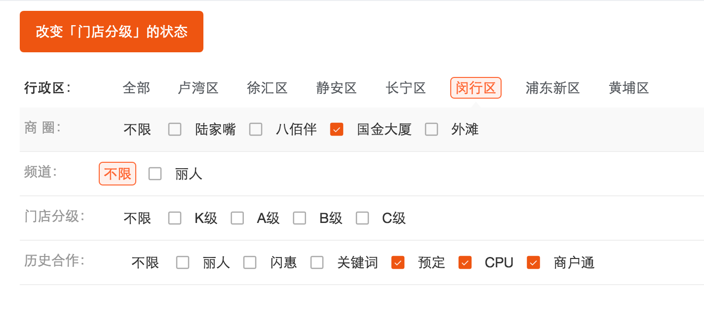

# eg-multicheck
搭配 eagle-ui 使用的多选组件

## 参数说明
- `title`： 类型`String`，设置多选组的lebal显示的字
- `defaultChecked`： 类型`String`|`Array`，设置默认选中的选项，默认为空，可选值为字符串或者数组
- `checkCallback`： 类型`Function`，选中事件的回调，其回调的参数值为选中的value值
- `spacing`： 类型`Number`， 设置选项距离label的偏移量，如果不指定，则会根据label的宽度自动计算

## 使用
```bash
$ npm install eg-multicheck --save
```

```javascript
import React, { Component ,PropTypes} from 'react';
import ReactDom from 'react/lib/ReactDOM';
import {Input} from 'eagle-ui';
import EgMultiCheck from 'eg-multicheck'

class Demo extends  Component {
    constructor(props){
        super(props)
    }
    multiCheck(values) {
        console.log('multiCheck', values)
    }
    render(){
        return (
            <div>
                <EgMultiCheck title='历史合作：' defaultChecked={['4', '5', '6']} checkCallback={this.multiCheck.bind(this)} spacing={100}>
                    <Input label="不限" type="checkbox" value="0"/>
                    <Input label="丽人" type="checkbox" value="1"/>
                    <Input label="闪惠" type="checkbox" value="2"/>
                    <Input label="关键词" type="checkbox" value="3"/>
                    <Input label="预定" type="checkbox" value="4"/>
                    <Input label="CPU" type="checkbox" value="5"/>
                    <Input label="商户通" type="checkbox" value="6"/>
                </EgMultiCheck>
            </div>
        )
    }
}
```
详细的使用请参见[example](https://future-team.github.io/eg-multicheck/examples/index.html)

## ⚠️注意

若要结合`LabelGroup`一起使用，达到父子如下效果时，注意需要添加一个class名为`eg-multicheck-wrap`的标签包裹`EgMultiCheck`，具体场景请参见 [example](https://future-team.github.io/eg-multicheck/examples/index.html)        
      
## Command
```
#测试	
npm run test	
#打包	
npm run build	
#例子演示	
npm start
```


